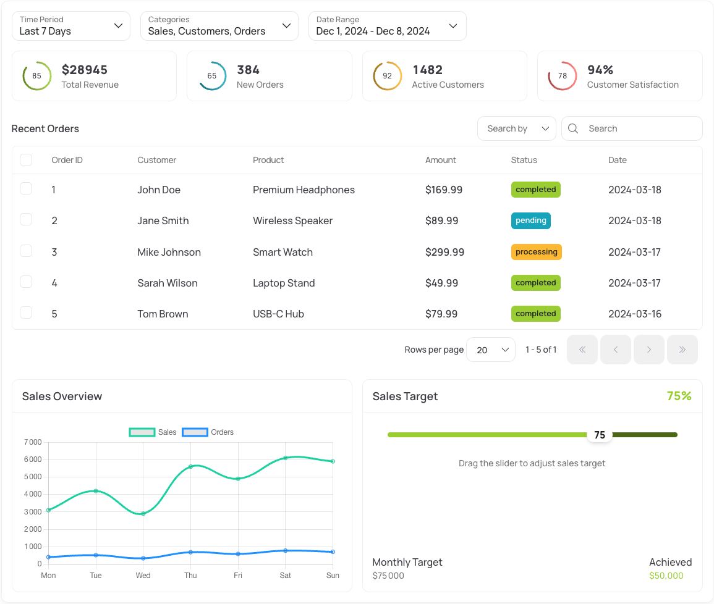

<div align="center">
  

  <h1>Maz UI</h1>
  <p>
    <strong>
      Lightweight and efficient library for Vue 3 & Nuxt 3
    </strong>
  </p>
</div>

<p align="center">
  <a href="https://vuejs.org"></a>
  <a href="https://v3.nuxtjs.org"></a>
  <a href="https://www.npmjs.com/package/maz-ui"></a>
  <a href="https://www.npmjs.com/package/maz-ui"></a>
  <a href="https://npm-stat.com/charts.html?package=maz-ui"></a>
</p>

<p align="center">
  <a href="https://qlty.sh/gh/LouisMazel/projects/maz-ui"></a>
  <a href="https://qlty.sh/gh/LouisMazel/projects/maz-ui"></a>
  
</p>

<h3 align="center">
  <a href="https://maz-ui.com">Documentation</a>
  <span> · </span>
  <a href="https://maz-ui.com/guide/getting-started">Getting Started</a>
  <span> · </span>
  <a href="https://maz-ui.com/made-with-maz-ui">Showcase</a>
</h3>

<p align="center">
  <picture>
    <source media="(prefers-color-scheme: dark)" srcset="./resources/dashboard-dark.png">
    
  </picture>
  <br>
  <sub><i>Example of a dashboard built with Maz UI components</i></sub>
</p>

## ✨ Features

- 🎯 **Cherry-pick components** - Use only what you need
- 🌙 **Dark mode** - Built-in dark mode support
- 🎨 **Themeable** - Easy to customize with CSS variables
- 📱 **Responsive** - Mobile-first design approach
- 🔧 **TypeScript** - Full type support included
- ⚡️ **Lightweight** - Tree-shakeable, no bloat
- 🔍 **SSR** - Server-side rendering ready

## 🚀 Quick Start

```bash
npm install maz-ui
```

### Vue 3

```ts
// main.ts
import 'maz-ui/styles'
```

#### 💡 Usage

Then, import and use only the components, composables, and more you need:

```vue
<template>
  <MazBtn>Click me!</MazBtn>
</template>

<script setup lang="ts">
  import MazBtn from 'maz-ui/components/MazBtn'
</script>
```

Use provided resolvers to enjoy auto-imports and TypeScript support: [Resolvers documentation](https://maz-ui.com/guide/getting-started#recommendations)

### Nuxt 3

The Nuxt module automatically:

- Imports all components, plugins, composables and directives on-demand (auto-imports)
- Includes required styles
- Provides TypeScript support out of the box

[See options and more in the documentation](https://maz-ui.com/guide/nuxt)

```ts
// nuxt.config.ts
export default defineNuxtConfig({
  modules: ['@maz-ui/nuxt'],
})
```

#### 💡 Usage

No need to import components, plugins, composables or directives, they are all auto-imported.

```vue
<template>
  <MazBtn @click="toast.success('Hello Maz UI!')"> Click me! </MazBtn>
</template>

<script setup lang="ts">
  const toast = useToast()
</script>
```

## 🎨 Theming Made Easy

Customize Maz UI to match your brand with our dedicated CLI tool:

```bash
# Install the CLI
npm install -g @maz-ui/cli

# Generate your theme
maz generate-css-vars
```

The CLI will automatically:

- Generate all color variations
- Create dark mode variables
- Output a ready-to-use CSS file

To know how configure the CLI, check [theming options](https://maz-ui.com/guide/theme) in our documentation.

## 🧰 What's included?

- 🧩 [Components](https://maz-ui.com/components/maz-btn) - Beautiful, accessible UI components
- 🔌 [Plugins](https://maz-ui.com/plugins/dialog) - Powerful plugins for common use cases
- 🎣 [Composables](https://maz-ui.com/composables/use-form-validator) - Reusable composition functions
- 📏 [Directives](https://maz-ui.com/directives/fullscreen-img) - Useful Vue directives
- 🛠️ [Helpers](https://maz-ui.com/helpers/currency) - Useful utilities for common tasks

## Icons

Maz UI provides a comprehensive set of beautiful icons (300+) ready-to-use for Vue applications, based on the amazing [Heroicons](https://heroicons.com/) set. All icons are optimized as Vue components with full TypeScript support.

### Documentation

Please refer to [](https://maz-ui.com/guide/icons)

### Installation

```bash
npm install @maz-ui/icons
```

### Usage

Import the icons you need from the package:

```vue
<script setup>
  import { MazCheckCircle, MazXMark, MazArrowTopRightOnSquare } from '@maz-ui/icons'
</script>

<template>
  <div>
    <CheckCircle class="text-green-500 h-6 w-6" />
    <XMark @click="close" class="text-red-500 h-5 w-5 cursor-pointer" />
    <ArrowTopRightOnSquare class="text-blue-500 h-4 w-4" />
  </div>
</template>
```

> **Note:** Icons are asynchronous Vue components optimized for tree-shaking. Only imported icons will be included in your final bundle.

## 🤝 Contributing

We're always looking for contributors! Check out our [contribution guide](./CONTRIBUTING.md) to get started.

## 📄 License

[MIT](./LICENSE)

<div align="center">
  <sub>Built with ❤️ by <a href="https://github.com/LouisMazel">Louis Mazel</a></sub>
</div>
