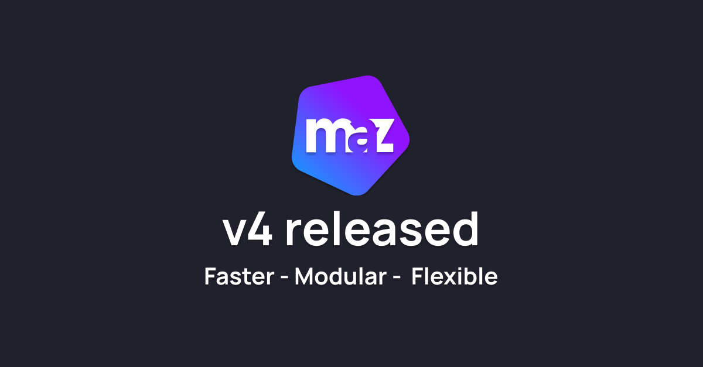

# Maz-UI v4.0.0 - The Complete Rebuild

After months of development, I'm announcing **Maz-UI v4.0.0** — a complete architectural rebuild focused on performance, modularity, and developer experience.

## Why I Built v4.0.0

Modern applications require better performance, smaller bundle sizes, and improved developer tooling. Maz-UI v3 served its purpose, but I wanted to address these requirements with a ground-up rebuild.

**The goals were:** Better tree-shaking, modular architecture, and enhanced TypeScript support.

## What's New

### Modular Architecture

Maz-UI v4 uses a monorepo structure where every component, composable, directive, and utility can be imported independently. This gives you better control over your bundle size.

### Bundle Size Improvements

Optimal tree-shaking implementation results in **60-90% bundle size reductions** compared to v3. You can now import exactly what you need.

```typescript
// Before v4: Large bundle with unused code
import * as MazUI from 'maz-ui'

// v4: Surgical imports for minimal bundles
import MazBtn from 'maz-ui/components/MazBtn'
import { useToast } from 'maz-ui/composables'
import { formatCurrency } from 'maz-ui/utils'
```

### Theme System

#### Four Theme Presets

Choose from four pre-built themes:

- **Maz-UI**: Vibrant and modern with signature Maz-UI aesthetics
- **Pristine**: Minimalist elegance
- **Ocean**: Fresh aquatic theme with deep blues and coral accents
- **Obsidian**: Sophisticated dark theme focused on readability

#### HSL CSS Variables & Smart Dark Mode

The theming system uses HSL variables for flexibility, with automatic color scale generation (50-950) and dark mode support.

```typescript
import { MazUi } from 'maz-ui/plugins/maz-ui'
import { ocean } from '@maz-ui/themes/presets'

app.use(MazUi, {
  theme: {
    preset: ocean,
    strategy: 'hybrid', // Optimal performance
    darkModeStrategy: 'class'
  }
})
```

### Internationalization

#### Multi-language Support

Support for 9 languages: English, French, German, Spanish, Italian, Portuguese, Japanese, and Chinese, with custom language integration.

```typescript
import { MazUi } from 'maz-ui/plugins/maz-ui'
import { fr, en } from '@maz-ui/translations'

app.use(MazUi, {
  translations: {
    locale: 'fr',
    fallbackLocale: 'en',
    messages: { fr, en }
  }
})
```

### Specialized Ecosystem Packages

- **@maz-ui/icons** - 840+ Icons
SVG icon library with Vue components, direct SVG files, and auto-import support.

- **@maz-ui/nuxt** - Nuxt Integration
Nuxt module with auto-imports and SSR support.

- **@maz-ui/themes** - Theming System
Pre-built theme collections and design tokens.

- **@maz-ui/translations** - Internationalization
Lightweight i18n system for Maz-UI components.

- **@maz-ui/mcp** - MCP Server
Model Context Protocol server that connects AI agents to Maz-UI documentation.

### New & Enhanced Components

- **MazPopover** - Overlay Component
Popover with positioning, trigger modes, and accessibility features.

- **MazSelectCountry** - Country Selector
Country/language selector with i18n support and flag display.

- **MazLink** - Link Component
Replaces `MazBtn variant="link"` with auto-external detection and icons.

- **MazExpandAnimation** - CSS Grid Animations
Replaces `MazTransitionExpand` with v-model control and timing functions.

- **MazDropzone** - File Upload
Rewritten without external dependencies, featuring auto-upload and event handling.

## Performance Improvements

| Metric | v3.x | v4.0.0 | Improvement |
|--------|------|--------|-------------|
| **Bundle Size** | ~500KB | ~50-200KB | **60-90%** reduction |
| **Tree-shaking** | Limited | Optimal | Perfect granular imports |
| **TypeScript** | Good | Excellent | Strict types with auto-completion |
| **Build Speed** | Standard | Enhanced | Faster compilation |

## Developer Experience

### TypeScript-First Architecture

All components, composables, and utilities include TypeScript definitions with IDE auto-completion. Types are prefixed with `Maz` for consistency.

### Auto-Import Resolvers

Integration with `unplugin-vue-components` and `unplugin-auto-import` for auto-imports.

### Composable-Based Architecture

Several utilities are now Vue composables:

```typescript
// Before: Utility function
import { idleTimeout } from 'maz-ui'

// v4: Vue composable with reactive state
import { useIdleTimeout } from 'maz-ui/composables'
const { isIdle } = useIdleTimeout({ timeout: 5000 })
```

### Enhanced Development Tools

- Nuxt DevTools integration
- Interactive documentation with live examples
- Comprehensive migration guides
- MCP server for AI-assisted development

## Key Features

### Modular

Import individual components without the entire library. Tree-shaking ensures minimal bundle size.

### SSR Compatible

Compatible with Nuxt and server-side rendering.

### TypeScript Support

Built with TypeScript with auto-completion and type safety.

### Theming System

HSL-based theming with CSS custom properties and multiple rendering strategies.

### Dark Mode

Components support light and dark themes with system preference detection.

### Complete Ecosystem

Components, plugins, directives, composables, and utilities.

## Getting Started

### For Vue Projects

```bash
npm install maz-ui@4.0.0
```

```typescript
// main.ts
import { createApp } from 'vue'
import { MazUi } from 'maz-ui/plugins/maz-ui'
import { mazUi } from '@maz-ui/themes/presets'
import { fr } from '@maz-ui/translations'
import 'maz-ui/styles'

const app = createApp(App)

app.use(MazUi, {
  theme: { preset: mazUi },
  translations: {
    locale: 'fr',
    fallbackLocale: 'en',
    messages: { fr }
  }
})

app.mount('#app')
```

### For Nuxt Projects

```bash
npm install @maz-ui/nuxt
```

```typescript
// nuxt.config.ts
export default defineNuxtConfig({
  modules: ['@maz-ui/nuxt'],
})
```

## Migration Resources

To help with migration from v3 to v4:

- **[Complete Migration Guide](../guide/migration-v4.md)** - Step-by-step migration instructions
- **[MCP Integration](../guide/mcp.md)** - Connect AI agents for migration assistance
- **[Interactive Examples](../index.md)** - Live demonstrations of new features
- **[Community Support](https://github.com/LouisMazel/maz-ui/discussions)** - Get help from the community

## Summary

Maz-UI v4.0.0 is a complete rebuild focusing on performance, modularity, and developer experience. The new architecture provides better tree-shaking, smaller bundles, and improved TypeScript support.

Whether you're building a small project or large application, v4 offers the components and tools you need with better performance characteristics.

## Essential Links

- **[Get Started](/guide/getting-started)** - Installation and setup
- **[View Components](/components/maz-btn)** - Explore 50+ components
- **[Migration Guide](/guide/migration-v4)** - Upgrade from v3.x
- **[GitHub Repository](https://github.com/LouisMazel/maz-ui)** - Source code & issues
- **[Changelog](https://github.com/LouisMazel/maz-ui/blob/master/CHANGELOG.md)** - Detailed release notes
- **[v3 Documentation](https://v3.maz-ui.com)** - Legacy version support

## Get Started

**Ready to try Maz-UI v4.0.0?**

<div class="maz-flex maz-gap-4 maz-mt-8 maz-flex-wrap">
  <MazBtn href="https://maz-ui.com/guide/getting-started" size="lg">
    Get Started Now
  </MazBtn>
  <MazBtn href="https://maz-ui.com/guide/migration-v4" color="background" outlined size="lg">
    Migration Guide
  </MazBtn>
  <MazBtn href="https://github.com/LouisMazel/maz-ui" color="background" outlined size="lg" target="blank">
    View on GitHub
  </MazBtn>
</div>

---

*Feel free to share your feedback and contribute to the project on GitHub.*
